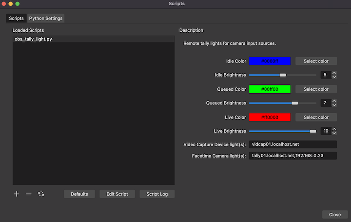

# OBS Script

TallyPi was created to work with [OBS](https://obsproject.com/forum/resources/tallypi-push-scene-changes-to-wifi-enabled-tally-lights.1082/) as a script
that fires whenever a video input source switches from program, preview,
or idle modes.

OBS 26 on MacOS did not support Python scripts, so for those still using that
version there is a Lua version that invokes `curl` within the Lua runtime.
All other users are encouraged to use the Python version of the script.


## Installing the Python Script

Installing the Python version of the script requires a specific version
of Python 3.9 with shared libraries installed, and then installing the
Python script itself.


### Installing Python for OBS 28

OBS 28 requires at least Python 3.6 shared libraries in order to execute
Python scripts. On Windows this can be done using a Python 3.9 installer,
and on MacOS this can be done using the
[Homebrew package manager](https://formulae.brew.sh/formula/python@3.9#default).

Starting with version 28, OBS changed the way the Python distribution was 
loaded into its scripting plugin. Now, rather than being tied to a specific 
Python release, OBS will search for any available installation and attempt 
to use that. From the 
[commit logs](https://github.com/obsproject/obs-studio/commit/ab21c7e5b098170ca468edc490c2d6705c65e021):
```
[OBS now] tries to find a best possible version (starting
with Python 3.10) down to and including Python 3.6 by existing file
naming conventions and loads the most recent variant it can find.

User specified search path is either a Python installation directory
(Windows), or a Framework directory containing `Python.framework`
(macOS). The dll or dylib names are composed automatically.
The Python home path is also composed automatically on macOS (where
it has to point inside the Framework directory).
```

If you are on a current version of MacOS for example, your can now set
your "Python Install Path" in the scripts settings dialog 
to be `/usr/local/Frameworks`. From there OBS 28 will search for an
appropriate Python version and load its libraries. Explicit versions
of Python do not need to be installed, so tools like `pyenv` are not needed.


### Installing Python for OBS 27

OBS 27 requires Python 3.9 shared libraries in order to execute
Python scripts. On Windows this can be done using a Python 3.9 installer,
and on MacOS or Linux this can be most easily managed through `pyenv`.

To install `pyenv` on MacOS I recommend first installing
[Homebrew](https://brew.sh/), and then installing `pyenv` via:

    brew update
    brew install pyenv

On MacOS and Linux you can ask `pyenv` to generate the shared libraries with:

    CONFIGURE_OPTS=--enable-shared pyenv install 3.9.4

Once Python is installed, point OBS to the installation path by opening
OBS and navigating to Tools -> Scripts -> Python Settings


### Installing the TallyPi Python Script

Download the latest OBS Python script for TallyPi from the release page
at https://github.com/deckerego/tally_pi/releases

Store the script wherever you like, then add the script to OBS by navigating
to Tools -> Scripts and adding the `obs_tally_light.py` script
that you just downloaded.


## Installing the Lua Script

Download the latest OBS Lua script for TallyPi from the release page
at https://github.com/deckerego/tally_pi/releases

Store the script wherever you like, then add the script to OBS by navigating
to Tools -> Scripts and adding the `obs_tally_light.lua` script
that you just downloaded.

Note that you must have `curl` installed on your machine for the script
to function. Rather than calling HTTP endpoints directly, the script has
to make a system call to the `curl` command line tool.


## Configuring the TallyPi Script

Once the script is installed, you can use the settings interface to specify
colors for idle/preview/program cameras, and map each camera source to an
IP address or hostname that corresponds to a tally light.



If you are having trouble finding your lights by hostname, you can use either
the [HTML dashboard page](../scripts/dashboard.html) or
[find_lights.sh](../scripts/find_lights.sh) command-line script to search
your network for available lights. Either option will provide you with an IPv4
address for each light found which can be used to setup the OBS plugin.
